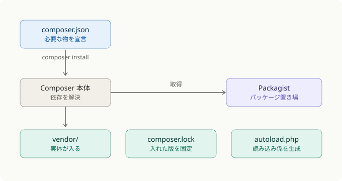
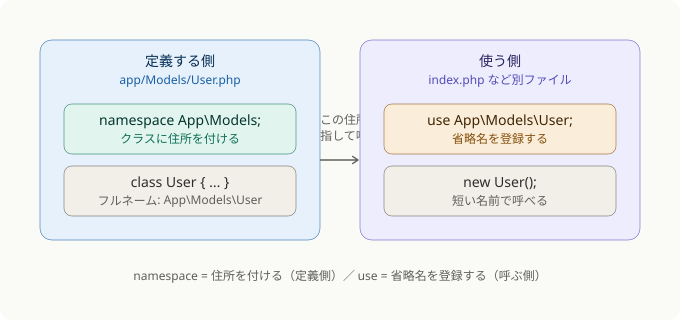

# PHP-B4-S1 解説: Composer と PSR-4 / namespace / use

## まず結論

Composer と「名前空間・use」は別レイヤーの話だが、絡み合っていて混乱しやすい。

- **Composer** … 必要なライブラリを集めてきて、自動読み込みの仕組みを用意してくれる道具（Maven 相当）
- **`namespace`** … クラスに付ける「住所」。同じクラス名の衝突を防ぐ（Java の `package` そのもの）
- **`use`** … その長い住所を毎回書かずに済むよう「省略名を登録する」宣言（Java の `import` そのもの）

3つは「クラスを置く → 読み込めるようにする → 短く呼ぶ」という流れで連携する。

## Composer が何をしているか



一番下の緑の3つが Composer の「成果物」。コードがライブラリを使えるのは
一番右の `autoload.php` のおかげ。各ファイルで `require 'monolog/...'` と書かなくても、
`require 'vendor/autoload.php';` の1行だけで全部使えるようになる。

その「autoload.php がクラスを見つける仕組み」が PSR-4 で、ここで `namespace` と `use` が登場する。

## namespace と use の違い



「定義する側」と「使う側」で見ると分かりやすい。Java 経験者ならほぼそのまま対応する。

- `namespace App\Models;` は Java の `package com.example.models;` と同じ。
  クラスに「どのパッケージに属するか」という住所を与える。
  これがないと全クラスがグローバル空間に並び、同名クラスがぶつかる。
- `use App\Models\User;` は Java の `import com.example.models.User;` と同じ。
  以降コード中で `App\Models\User` というフルネームを毎回書かずに `User` だけで呼べる。
  `use` を書かなければ `new \App\Models\User()` とフルネームで書く必要がある（動くが面倒）。

PHP と Java で違うのは区切り文字だけ。Java はドット `com.example.User`、
PHP はバックスラッシュ `App\Models\User`。

## PSR-4 が3つをつなぐ

PSR-4 は「住所とフォルダ構造を一致させる」という規約。
これを `composer.json` に1回書いておくと、生成された `autoload.php` が
住所からファイルの場所を逆算できるようになる。

```json
"autoload": {
    "psr-4": {
        "App\\": "app/"
    }
}
```

「`App\` で始まる住所のクラスは `app/` フォルダの中にある」という対応が登録される。
すると `App\Models\User` を `new` した瞬間、autoload.php が
「`App\` を `app/` に置き換え、残りの `Models\User` をパスにする → `app/Models/User.php`」
と計算して、そのファイルを自動で読み込む。だから `require` を1つも書かずにクラスが使える。

## まとめ

`namespace` で住所を付ける → PSR-4 設定で「住所とフォルダの対応」を Composer に教える
→ `autoload.php` が住所からファイルを見つけて読み込む → 使う側は `use` で省略名を登録して短く呼ぶ。

実際の記述は S5・S6 で手を動かす。S1 時点では
「Composer が autoload.php を作る」「PSR-4 が住所とフォルダをつなぐ」
「namespace/use はそのための住所と省略名」という関係が見えていれば十分。

## Java との対比

| 概念 | Java | PHP |
|------|------|-----|
| 住所を付ける | `package` | `namespace` |
| 省略名を登録 | `import` | `use` |
| 区切り文字 | `.`（ドット） | `\`（バックスラッシュ） |
| 依存管理ツール | Maven / Gradle | Composer |
| 依存定義ファイル | `pom.xml` | `composer.json` |

## よくある誤解

- `vendor/` を Git に入れてしまう → 入れない(`.gitignore` 対象)
- `composer.lock` を Git に入れない → 入れる(チームでバージョンを揃えるため)